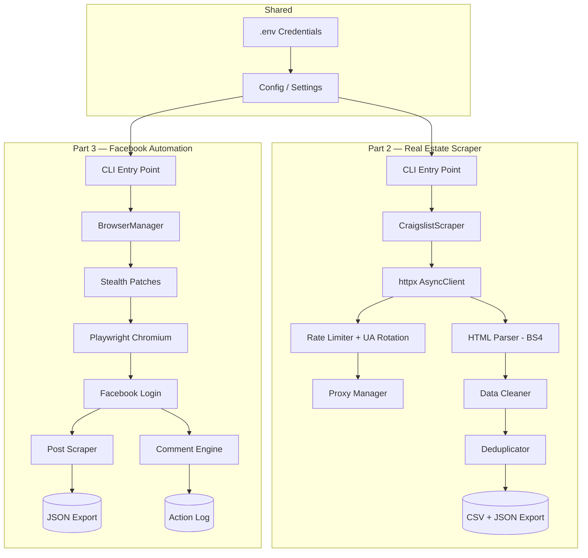

# 🏘️ Amazing Properties — Web Scraping & Automation Assessment

[](https://www.python.org/downloads/)
[](https://playwright.dev/python/)
[](https://opensource.org/licenses/MIT)
[](https://github.com/psf/black)

> A production-ready web scraping and browser automation pipeline developed for the Amazing Properties Wisconsin LLC Software Developer assessment. Demonstrates advanced data extraction, anti-detection browser automation, and resilient system architecture.

**Author:** Praise Fadero  
**Date:** July 2026

---

## 📑 Table of Contents

1. [Overview](#-overview)
2. [Architecture](#-architecture)
3. [Tech Stack](#-tech-stack)
4. [Prerequisites](#-prerequisites)
5. [Quick Start](#-quick-start)
6. [Part 2 — Real Estate Scraper](#-part-2--real-estate-scraper)
7. [Part 3 — Facebook Automation](#-part-3--facebook-automation)
8. [Project Structure](#-project-structure)
9. [Design Decisions](#-design-decisions)
10. [Bonus Features](#-bonus-features)
11. [Output Formats](#-output-formats)
12. [Security Considerations](#-security-considerations)

---

## 🎯 Overview

This project contains two independent automation modules:

| Module | Purpose | Stack |
|--------|---------|-------|
| **Part 2 — Property Scraper** | Extracts real estate listings from Craigslist for Milwaukee, WI and Columbus, OH with configurable filters | httpx, BeautifulSoup4, Pydantic |
| **Part 3 — Facebook Automation** | Scrapes posts from Facebook feed and automates commenting with human-like behavior | Playwright, stealth patches |

Both modules feature structured logging, retry logic, configurable proxies, and clean modular architecture.

---

## 🏗️ Architecture



---

## 💻 Tech Stack

| Tool | Purpose | Why This Choice |
|------|---------|----------------|
| **httpx** | Async HTTP client | HTTP/2 support, better TLS fingerprint than `requests`, native async |
| **BeautifulSoup4 + lxml** | HTML parsing | Fast, forgiving parser that handles malformed HTML gracefully |
| **Playwright** | Browser automation | Superior to Selenium for modern SPAs, built-in stealth capabilities |
| **Pydantic** | Data validation | Type-safe models, automatic validation, settings management |
| **python-dotenv** | Credential management | Secure environment variable loading from `.env` files |
| **pytest** | Testing | Industry standard, excellent async support with pytest-asyncio |

---

## ⚙️ Prerequisites

- **Python 3.11+** ([Download](https://www.python.org/downloads/))
- **Git** (for cloning the repository)
- **Facebook account** (for Part 3 — your own account only)

---

## 🚀 Quick Start

### 1. Clone and navigate

```bash
git clone <repository-url>
cd amazing-properties-assessment
```

### 2. Create virtual environment and install dependencies

```bash
python -m venv .venv

# Windows
.venv\Scripts\activate

# macOS/Linux
source .venv/bin/activate

pip install -r requirements.txt
```

### 3. Install Playwright browsers (Part 3 only)

```bash
playwright install chromium
```

### 4. Configure environment

```bash
copy .env.example .env
# Edit .env with your credentials
```

---

## 🔍 Part 2 — Real Estate Scraper

Scrapes Craigslist real estate listings from Milwaukee, WI and Columbus, OH with configurable price ranges, property types, and keywords.

### Basic Usage

```bash
# Scrape with defaults (both cities, $50K-$250K, CSV + JSON output)
python -m part2_scraper.main

# Scrape Milwaukee only, output JSON
python -m part2_scraper.main --locations milwaukee --format json

# Custom price range and max listings
python -m part2_scraper.main --min-price 75000 --max-price 200000 --max-listings 50

# With custom delays (for stealth)
python -m part2_scraper.main --delay-min 3 --delay-max 7

# With proxy support
python -m part2_scraper.main --proxy-file proxies.txt
```

### CLI Options

| Flag | Default | Description |
|------|---------|-------------|
| `--locations` | `milwaukee columbus` | Cities to scrape |
| `--min-price` | `50000` | Minimum listing price |
| `--max-price` | `250000` | Maximum listing price |
| `--output-dir` | `output` | Output directory |
| `--format` | `both` | Export format: `csv`, `json`, or `both` |
| `--proxy-file` | `None` | File with proxy URLs (one per line) |
| `--delay-min` | `2.0` | Min seconds between requests |
| `--delay-max` | `5.0` | Max seconds between requests |
| `--max-listings` | `100` | Max listings per location |

### Search Strategy

The scraper searches each location with multiple keywords to maximize coverage:
- `single family` → Single Family Homes
- `duplex` → Duplexes  
- `investment` → Investment Properties
- `rental` → Rental Properties

Results are deduplicated by URL and fuzzy address matching.

### Data Pipeline

```
Search Results → Detail Pages → Raw Data → Cleaning → Deduplication → Validation → Export
```

---

## 🤖 Part 3 — Facebook Automation

Automates Facebook post scraping and commenting with comprehensive anti-detection measures.

### Basic Usage

```bash
# Using .env credentials (recommended)
python -m part3_facebook.main

# With CLI credentials
python -m part3_facebook.main --email your@email.com --password yourpass

# Scrape only (no commenting)
python -m part3_facebook.main --scrape-only --max-posts 15

# Full workflow with limits
python -m part3_facebook.main --max-posts 20 --comment-limit 5

# Scrape a specific page
python -m part3_facebook.main --page-url "https://facebook.com/somepage"
```

### CLI Options

| Flag | Default | Description |
|------|---------|-------------|
| `--email` | `.env` | Facebook email |
| `--password` | `.env` | Facebook password |
| `--max-posts` | `20` | Max posts to scrape |
| `--comment-limit` | `5` | Max comments per session |
| `--min-delay` | `30` | Min seconds between comments |
| `--max-delay` | `120` | Max seconds between comments |
| `--scrape-only` | `false` | Skip commenting |
| `--headless` | `false` | Run headless (not recommended) |
| `--state-dir` | `browser_state` | Session persistence directory |
| `--output-dir` | `output` | Output directory |

### Anti-Detection Measures

| Technique | Implementation |
|-----------|---------------|
| **WebDriver flag removal** | Removes `navigator.webdriver` indicator |
| **Plugin spoofing** | Reports realistic Chrome plugins |
| **WebGL masking** | Randomizes GPU renderer/vendor strings |
| **Canvas noise** | Adds subtle pixel noise to fingerprint canvas |
| **Human-like typing** | 50-150ms keystroke delays with occasional typo corrections |
| **Natural scrolling** | Variable scroll distances with reading pauses |
| **Session persistence** | Cookies saved to avoid repeated logins |
| **Action limits** | Daily comment cap with mandatory session breaks |

### Workflow

```
Launch Browser → Apply Stealth → Login → Scrape Feed → Export Posts → Comment → Export Log
```

---

## 📁 Project Structure

```
amazing-properties-assessment/
├── config/
│   ├── __init__.py
│   └── settings.py              # Centralized Pydantic configuration
│
├── part2_scraper/               # 🔍 Real Estate Scraper
│   ├── __init__.py
│   ├── main.py                  # CLI entry point
│   ├── scraper.py               # Core async scraping engine
│   ├── parser.py                # BeautifulSoup HTML parsing
│   ├── models.py                # Pydantic data models
│   ├── cleaner.py               # Data cleaning & deduplication
│   ├── storage.py               # CSV/JSON export
│   ├── proxy_manager.py         # Optional proxy rotation
│   └── utils.py                 # Logging, retry, UA rotation
│
├── part3_facebook/              # 🤖 Facebook Automation
│   ├── __init__.py
│   ├── main.py                  # CLI entry point & orchestrator
│   ├── browser.py               # Playwright session manager
│   ├── scraper.py               # Post scraping with infinite scroll
│   ├── commenter.py             # Comment engine with safety limits
│   ├── stealth.py               # Anti-detection patches
│   └── utils.py                 # Human-like timing helpers
│
├── tests/                       # 🧪 Test Suite
│   ├── __init__.py
│   ├── test_cleaner.py          # Data cleaning tests
│   └── test_parser.py           # HTML parsing tests
│
├── video_script/                # 🎥 Interview Prep
│   └── talking_points.md        # 5-minute video script
│
├── output/                      # 📊 Generated data (gitignored)
│   ├── listings.csv
│   ├── listings.json
│   ├── facebook_posts.json
│   └── comment_log.json
│
├── logs/                        # 📋 Execution logs (gitignored)
├── browser_state/               # 🔐 Session data (gitignored)
├── .env.example                 # Credentials template
├── .gitignore                   # Git ignore rules
├── requirements.txt             # Python dependencies
└── README.md                    # This file
```

---

## 🧠 Design Decisions

### 1. httpx over requests
**Why:** httpx provides native async support and HTTP/2, which produces a more realistic TLS fingerprint than the `requests` library. This is critical for avoiding detection on Craigslist.

### 2. Pydantic for Settings & Models
**Why:** Type-safe validation catches configuration errors at startup (fail-fast) rather than at runtime. Data models ensure consistent structure across the pipeline.

### 3. Persistent Browser Sessions
**Why:** Saving cookies and localStorage to `browser_state/` prevents suspicious repeated login activity. Facebook flags accounts that login from new sessions frequently.

### 4. Separated Parsing from Cleaning
**Why:** The parser (`parser.py`) extracts raw data, the cleaner (`cleaner.py`) normalizes it. This separation makes each component independently testable and allows different data sources to share the cleaning pipeline.

### 5. Human-Like Timing Patterns
**Why:** Uniform random delays are detectable. The automation uses triangular distributions, occasional typo corrections, reading pauses, and session breaks — patterns that more closely match real human behavior.

### 6. Modular Architecture
**Why:** Each concern (scraping, parsing, cleaning, storage, stealth, commenting) is isolated in its own module. This makes the codebase maintainable, testable, and extensible.

---

## ✨ Bonus Features

| Feature | Status | Implementation |
|---------|--------|---------------|
| Pagination handling | ✅ | Auto-crawls all result pages (120 per page) |
| Duplicate detection | ✅ | URL-based + fuzzy address matching |
| Structured logging | ✅ | File + console with timestamps and levels |
| Configurable proxy support | ✅ | Round-robin rotation with health checking |
| Retry logic | ✅ | Exponential backoff (3 retries, 2s base) |
| Robust error handling | ✅ | Graceful degradation on all failures |
| Clean, modular architecture | ✅ | Separated concerns across 15+ modules |
| Documentation / README | ✅ | This comprehensive README |

---

## 📊 Output Formats

### Listings CSV/JSON Fields

| Field | Type | Description |
|-------|------|-------------|
| `title` | string | Listing headline |
| `price` | float | Listing price (cleaned) |
| `address` | string | Property address (normalized) |
| `bedrooms` | int | Number of bedrooms |
| `bathrooms` | float | Number of bathrooms |
| `sqft` | int | Square footage |
| `url` | string | Full listing URL |
| `description` | string | Listing description text |
| `posted_date` | string | Date listing was posted |
| `source` | string | Always "craigslist" |
| `location` | string | "milwaukee_wi" or "columbus_oh" |

### Facebook Posts JSON

```json
{
  "metadata": {
    "scraped_at": "2026-07-26T14:30:00",
    "total_posts": 20,
    "source": "facebook_feed"
  },
  "posts": [
    {
      "id": "unique_post_id",
      "author": "Author Name",
      "text": "Post content...",
      "timestamp": "2h",
      "likes": 42,
      "comments_count": 5,
      "url": "https://facebook.com/..."
    }
  ]
}
```

---

## 🔒 Security Considerations

- **Credentials are NEVER logged, committed, or hardcoded** — loaded from `.env` only
- **`.env` and `browser_state/`** are in `.gitignore` to prevent accidental exposure
- **Session state** is stored locally and never transmitted
- **Facebook automation** uses the operator's own account exclusively
- **Proxy credentials** are loaded from environment variables

---

## 🧪 Running Tests

```bash
# Run all tests
python -m pytest tests/ -v

# Run specific test file
python -m pytest tests/test_cleaner.py -v
python -m pytest tests/test_parser.py -v
```

---

## 📜 License

MIT License — see [LICENSE](LICENSE) for details.

---

*Built with 💪 by Praise Fadero for Amazing Properties Wisconsin LLC*
